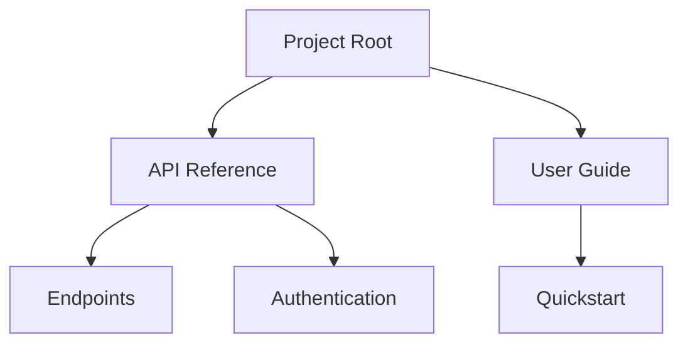

## Overview

HolyDuck provides powerful tools to manage your documentation effectively. You can structure content hierarchically, collaborate in real-time, track changes through version history, and find information quickly with advanced search. These features help teams maintain high-quality docs without complexity.

<Callout kind="info">
HolyDuck streamlines documentation workflows for developers and technical writers.
</Callout>

## Key Features

Explore the core capabilities that make HolyDuck stand out.

<Columns cols={2}>
  <Card title="Document Structuring" icon="layers" href="#document-structuring">
    Build nested hierarchies for organized content.
  </Card>
  <Card title="Real-time Collaboration" icon="users" href="#real-time-collaboration">
    Edit docs simultaneously with your team.
  </Card>
  <Card title="Version History" icon="git-branch" href="#version-history">
    Track and revert changes effortlessly.
  </Card>
  <Card title="Search and Filtering" icon="search" href="#search-filtering">
    Locate content with powerful queries.
  </Card>
</Columns>

## Document Structuring and Hierarchies

Organize your documentation into logical hierarchies using folders and pages. You create parent-child relationships to reflect your project's structure, making navigation intuitive.

### How to Structure Documents

<Steps>
  <Step title="Create a Folder" icon="folder">
    Start by adding a top-level folder for your project.

````bash
curl -X POST https://api.example.com/v1/folders \
  -H "Authorization: Bearer YOUR_API_KEY" \
  -d '{"name": "API Reference", "parentId": null}'
````

  </Step>
  <Step title="Add Child Pages" icon="file-text">
    Nest pages under folders for hierarchy.

````bash
curl -X POST https://api.example.com/v1/pages \
  -H "Authorization: Bearer YOUR_API_KEY" \
  -d '{"title": "Endpoints", "folderId": "folder-123", "content": "# API Endpoints\nList your routes here."}'
````

  </Step>
  <Step title="Preview Hierarchy" icon="eye">
    View the tree structure in the dashboard at `https://dashboard.example.com/docs`.
  </Step>
</Steps>

This approach keeps your docs scalable.



## Real-time Collaboration Editing

Invite team members to edit docs simultaneously. Changes appear instantly, with cursors showing who edits what.

<Tabs>
  <Tab title="Invite Collaborators" icon="user-plus">
    Use the dashboard to add users by email.
  </Tab>
  <Tab title="Live Edits" icon="edit-3">
    Open the same doc in multiple browsers to see real-time updates.
  </Tab>
</Tabs>

<Callout kind="tip">
Resolve conflicts automatically during simultaneous edits.
</Callout>

## Version History Tracking

HolyDuck saves every change as a version. You compare diffs, restore previous states, or branch for experiments.

<Expandable title="View Version Diffs" default-open="true">
  Access history via API:

<CodeGroup tabs="cURL,JavaScript">
````bash
curl https://api.example.com/v1/pages/page-123/versions \
  -H "Authorization: Bearer YOUR_API_KEY"
````
````javascript
const response = await fetch('https://api.example.com/v1/pages/page-123/versions', {
  headers: { Authorization: `Bearer ${YOUR_API_KEY}` }
});
const versions = await response.json();
console.log(versions);
````
</CodeGroup>

</Expandable>

## Search and Filtering Capabilities

Find docs quickly with full-text search and filters. Query by title, content, tags, or author.

| Filter Type | Example Query | Use Case |
|-------------|---------------|----------|
| Title | `title:api` | Find API pages |
| Content | `auth token` | Locate auth sections |
| Tags | `tags:core` | Filter essential docs |
| Author | `author:alice` | Review team contributions |

Integrate search into your apps:

<CodeGroup tabs="JavaScript,Python">
````javascript
const results = await fetch('https://api.example.com/v1/search?q=api+auth', {
  headers: { Authorization: `Bearer YOUR_API_KEY` }
}).then(r => r.json());
````
````python
import requests
response = requests.get(
    'https://api.example.com/v1/search?q=api+auth',
    headers={'Authorization': f'Bearer {YOUR_API_KEY}'}
)
results = response.json()
````
</CodeGroup>

## Next Steps

<Columns cols={3}>
  <Card title="Quickstart" icon="rocket" href="/quickstart">
    Set up your first doc.
  </Card>
  <Card title="Authentication" icon="shield" href="/authentication">
    Secure your API access.
  </Card>
  <Card title="Advanced Guides" icon="book-open" href="/guides">
    Dive deeper into features.
  </Card>
</Columns>

<Callout kind="success">
Start structuring your docs today for better organization and team efficiency.
</Callout>