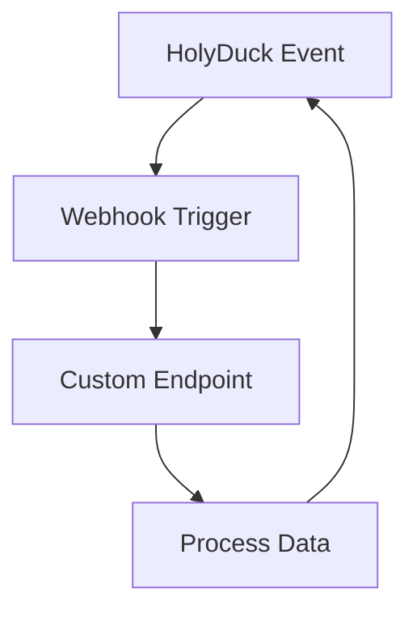

## Overview

HolyDuck supports a variety of integrations to enhance your workflows. Connect version control systems, third-party applications, webhooks, and custom APIs to automate tasks and sync data seamlessly.

<Callout kind="tip">
Review the [HolyDuck Dashboard](https://dashboard.example.com/integrations) to manage all your connections in one place.
</Callout>

<Columns cols={3}>
  <Card title="Git Integration" icon="git-branch" href="#git-integration">
    Sync repositories for automated deployments.
  </Card>
  <Card title="Third-Party Apps" icon="plug" href="#third-party">
    Connect Slack, GitHub, and more.
  </Card>
  <Card title="Webhooks & APIs" icon="zap" href="#webhooks">
    Build custom automations.
  </Card>
</Columns>

## Git Integration

Set up Git integration to automatically trigger HolyDuck workflows on commits, pushes, or pull requests.

<Steps>
  <Step title="Enable Git in Dashboard" icon="settings">
    Navigate to Integrations > Git in your HolyDuck dashboard.
  </Step>
  <Step title="Authorize Repository">
    Select your Git provider and grant access to the target repository.
  </Step>
  <Step title="Configure Webhook">
    Add the HolyDuck webhook URL to your repository settings:
    
    ```
    https://api.example.com/v1/webhooks/git
    ```
  </Step>
  <Step title="Test Connection" icon="check-circle">
    Push a test commit to verify the integration.
  </Step>
</Steps>

<Callout kind="success">
Git integration supports GitHub, GitLab, and Bitbucket out of the box.
</Callout>

## Third-Party App Connections

Connect popular apps using OAuth or API keys for bidirectional data flow.

<Tabs>
  <Tab title="Slack" icon="message-circle">
    Send notifications to Slack channels on HolyDuck events.
    
    <Steps>
      <Step title="Get Slack Token">
        Create a Slack app and generate a bot token.
      </Step>
      <Step title="Add to HolyDuck">
        Paste `YOUR_SLACK_TOKEN` in Dashboard > Integrations > Slack.
      </Step>
    </Steps>
    
    ```javascript
    // Example Slack payload from HolyDuck
    {
      "channel": "#holyduck-updates",
      "text": "Deployment succeeded! 🚀"
    }
    ```
  </Tab>
  <Tab title="GitHub" icon="github">
    Mirror issues and PRs between GitHub and HolyDuck.
    
    ```bash
    curl -X POST https://api.example.com/v1/integrations/github \
      -H "Authorization: Bearer YOUR_API_KEY" \
      -d '{"repo": "your-org/repo"}'
    ```
  </Tab>
</Tabs>

## Webhook Configuration

Webhooks enable real-time event notifications. Configure them to receive payloads from HolyDuck.

<CodeGroup tabs="cURL,JavaScript,Python">
  ```bash
  curl -X POST https://your-webhook-url.com/holyduck \
    -H "HolyDuck-Signature: {signature}" \
    -d '{
      "event": "deployment.completed",
      "project": "my-app",
      "status": "success"
    }'
  ```
  ```javascript
  const express = require('express');
  const app = express();
  
  app.post('/holyduck', express.raw({type: 'application/json'}), (req, res) => {
    const payload = JSON.parse(req.body);
    console.log('Event:', payload.event);
    res.status(200).send('OK');
  });
  ```
  ```python
  from flask import Flask, request
  
  app = Flask(__name__)
  
  @app.route('/holyduck', methods=['POST'])
  def webhook():
      payload = request.json
      print(f"Event: {payload['event']}")
      return 'OK', 200
  ```
</CodeGroup>

Verify signatures using your `WEBHOOK_SECRET` from the dashboard.

## Custom API Integrations

Build advanced integrations using HolyDuck's REST API.

<Request tabs="cURL,JavaScript" show-lines="true">
  ```bash
  curl -X POST https://api.example.com/v1/integrations/custom \
    -H "Authorization: Bearer YOUR_API_KEY" \
    -H "Content-Type: application/json" \
    -d '{
      "name": "My Custom Integration",
      "endpoint": "https://my-service.com/api",
      "events": ["user.signup", "project.deploy"]
    }'
  ```
  ```javascript
  const response = await fetch('https://api.example.com/v1/integrations/custom', {
    method: 'POST',
    headers: {
      'Authorization': 'Bearer YOUR_API_KEY',
      'Content-Type': 'application/json'
    },
    body: JSON.stringify({
      name: 'My Custom Integration',
      endpoint: 'https://my-service.com/api',
      events: ['user.signup', 'project.deploy']
    })
  });
  ```
</Request>

<Response tabs="200">
  ```json
  {
    "id": "int_123abc",
    "status": "active",
    "endpoint": "https://my-service.com/api"
  }
  ```
</Response>

<ParamField path="name" param-type="string" required="true">
  Unique name for your integration.
</ParamField>

<ParamField path="endpoint" param-type="string" required="true">
  Target URL for event payloads.
</ParamField>

<ParamField path="events" param-type="array" required="true">
  Array of event types to subscribe to.
</ParamField>



<Expandable title="Advanced Webhook Security" default-open="false">
Enable HMAC signatures and IP whitelisting in your dashboard for production use.
</Expandable>